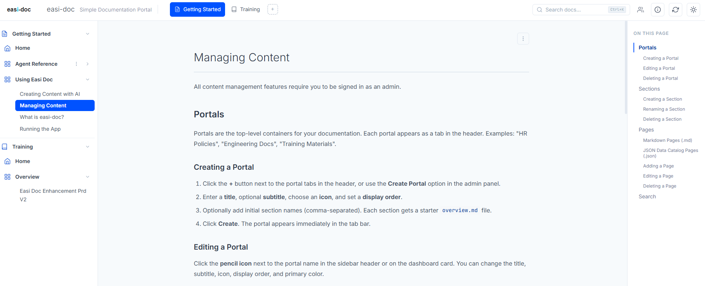

# easi-doc

A simple, portable documentation and data catalog portal. Runs as a standalone Windows executable — no Node.js, no terminal, no setup required for end users.



## Features

- **Multi-portal** — Each folder in `portals/` becomes a separate documentation portal, auto-discovered at startup
- **Data catalog** — JSON files render as interactive, searchable data-schema tables with layer/table/column drill-down
- **Markdown docs** — Syntax highlighting, Mermaid diagrams, auto-generated TOC, SharePoint embeds
- **Full-text search** — MiniSearch-powered search-as-you-type with keyboard navigation (Ctrl+K)
- **Full CRUD** — Create, edit, and delete portals, sections, and pages from the browser (admin only)
- **Split-pane editor** — CodeMirror 5 markdown editor with live preview
- **Drag-and-drop upload** — Drop `.md`, `.txt`, `.docx`, `.pdf`, or `.json` files to upload (admin only)
- **File conversion** — DOCX (via mammoth.js) and PDF (via pdf.js) auto-converted to markdown on upload
- **Username/password auth** — bcrypt-hashed passwords, brute-force lockout, admin management
- **UUID-based content index** — Stable `easidoc://` internal links, persisted per-portal content index
- **Dark/light theme** — Toggle with localStorage persistence
- **Portable** — Packages as a standalone Windows exe via @yao-pkg/pkg

## For End Users

1. Unzip the distribution folder
2. Double-click **`easi-doc.exe`** (or `start.bat`)
3. Your browser opens automatically to `http://localhost:3000`
4. On first run (with auth enabled), you'll be asked to set up an admin account
5. As admin, you can create portals, add pages, upload data catalogs, and manage other admins

## For Developers / Building

### Prerequisites

- [Node.js](https://nodejs.org/) 18+ (only needed to build, not to run the exe)

### Build the executable

```
npm install
build.bat
```

This creates a `dist/` folder containing everything needed to distribute:

```
dist/
├── easi-doc.exe       ← The application
├── public/            ← Frontend assets (CSS, JS, images)
├── portals/           ← Portal content (markdown, JSON)
├── config.json        ← Branding configuration
├── data/              ← Created on first run (admin data)
└── start.bat          ← Launcher script
```

Zip the `dist/` folder and share it. Recipients unzip and double-click.

### Run without building (dev mode)

```
npm install
npm start
```

Then open `http://localhost:3000`.

## Rebranding

To customize for your organization:

| What | Where |
|------|-------|
| App name & subtitle | `config.json` → `name`, `subtitle` |
| Logo | Replace `public/assets/images/easi-doc-logo.svg` |
| Colors | `config.json` → `colors` |
| Exe filename | `package.json` → `scripts.build` → change `easi-doc.exe` |
| About page | `public/assets/content/about.md` |

## Authentication

Controlled by `config.json` → `auth.mode`:

| Mode | Description |
|------|-------------|
| `"none"` (default) | Open access. Anyone can view content. Admin features (creating portals, adding pages) are disabled. |
| `"credentials"` | Username/password admin system. First visitor sets up an admin account with bcrypt-hashed password. Admins can create portals, add content, and manage other admins from the browser. Brute-force lockout after 10 failed attempts (5-minute cooldown). |

To enable admin features, set `"auth": { "mode": "credentials" }` in `config.json`.

### Admin Management

- First admin is created via the setup screen on first run
- Existing admins can add new admins with temporary passwords
- New admins are prompted to change their password on first login
- Last admin cannot be deleted (safety check)

## How It Works

- **Portals**: Each folder in `portals/` with a `portal.json` becomes a portal. Portals are auto-discovered — no code changes needed.
- **Content Index**: Each portal gets a persisted `content-index.json` with UUID-assigned sections and pages. Auto-generated from the filesystem on first run.
- **Admin system** (credentials mode): First visitor sets up an admin account. Admins can create portals, add/edit/delete content, and manage other admins — all from the browser.
- **Content**: Markdown files render as documentation pages. JSON files render as interactive data catalogs with search, expand/collapse, and column-level detail.
- **Search**: Full-text search powered by MiniSearch. Index auto-built on startup, incrementally updated on content changes, persisted to `portals/_search-index.json`.
- **Upload**: Admins can drag-and-drop files onto the content area. DOCX and PDF files are client-side converted to markdown. Upload dialog lets you choose portal, section, and title — or create new portals and sections inline.
- **No database**: Everything is flat files (JSON, Markdown). Portable and easy to back up.

## Folder Structure

```
easi-doc/
├── server/                         ← Express backend
│   ├── index.js                    ← Entry point (pkg-aware path resolution)
│   ├── routes/
│   │   ├── api.js                  ← Route assembler (mounts all sub-routers)
│   │   ├── auth.js                 ← Auth endpoints (setup, login, logout, admin CRUD)
│   │   ├── portals.js              ← Portal CRUD + content index endpoints
│   │   ├── content.js              ← Content serving + CRUD
│   │   └── search.js               ← Full-text search endpoint
│   ├── services/
│   │   ├── admin-store.js          ← Admin user persistence (bcrypt, lockout)
│   │   ├── content-index-store.js  ← Persisted content index with UUIDs
│   │   ├── content-indexer.js      ← Filesystem content scanner (fallback)
│   │   ├── portal-discovery.js     ← Portal auto-discovery
│   │   └── search-store.js         ← MiniSearch full-text index
│   └── utils/
│       └── validation.js           ← Shared validators (portalId, contentPath)
├── public/                         ← Frontend (vanilla JS, no framework)
│   ├── index.html
│   └── assets/
│       ├── css/styles.css          ← Full design system (light/dark themes)
│       ├── js/
│       │   ├── app.js              ← Main orchestrator (routing, admin UI)
│       │   ├── components/
│       │   │   ├── nav-tree.js         ← Sidebar navigation tree
│       │   │   ├── portal-switcher.js  ← Header portal tabs
│       │   │   ├── markdown-viewer.js  ← Markdown renderer (marked + hljs + mermaid)
│       │   │   ├── json-catalogue.js   ← Data catalog table renderer
│       │   │   ├── page-editor.js      ← Split-pane CodeMirror editor
│       │   │   ├── search-bar.js       ← Search-as-you-type with dropdown
│       │   │   ├── drop-zone.js        ← Drag-and-drop file handling
│       │   │   ├── upload-dialog.js    ← Upload placement dialog
│       │   │   ├── admin-modal.js      ← Admin panel overlay
│       │   │   ├── about-modal.js      ← About page overlay
│       │   │   └── copilot-panel.js    ← AI chat panel (placeholder)
│       │   └── services/
│       │       ├── content-loader.js   ← API client with caching
│       │       ├── theme-manager.js    ← Dark/light theme toggle
│       │       └── file-converter.js   ← Client-side file conversion
│       ├── vendor/                     ← Vendored libraries (no CDN)
│       │   ├── marked.min.js
│       │   ├── highlight.min.js
│       │   ├── mermaid.min.js
│       │   ├── mammoth.browser.min.js  ← DOCX converter (lazy-loaded)
│       │   ├── codemirror/             ← CodeMirror 5 editor bundle
│       │   └── pdfjs/                  ← PDF.js text extractor (lazy-loaded)
│       └── images/
├── portals/                        ← Content (one folder per portal)
│   ├── _search-index.json          ← Persisted full-text search index
│   └── <portal-name>/
│       ├── portal.json             ← Portal manifest (title, icon, order)
│       ├── content-index.json      ← Persisted content tree with UUIDs
│       └── <section>/              ← Section folders with content files
├── data/                           ← Created on first run
│   └── admins.json                 ← Admin accounts (bcrypt hashed)
├── config.json                     ← Global branding + auth config
├── package.json
├── build.bat                       ← Build script (creates dist/)
└── start.bat                       ← Launcher (copied to dist/)
```

## Content Types

| Extension | Renderer | Features |
|-----------|----------|----------|
| `.md` | Markdown viewer | Syntax highlighting, Mermaid diagrams, auto-generated TOC, `easidoc://` internal links |
| `.json` | JSON catalogue | Searchable data-schema tables with layer/table/column drill-down |

### Drag-and-Drop Upload

Admins can drag files directly onto the content area. Supported formats:

| Extension | Conversion |
|-----------|-----------|
| `.md` | Direct upload |
| `.txt` | Treated as markdown |
| `.docx` | Converted to markdown via mammoth.js |
| `.pdf` | Text extracted via pdf.js |
| `.json` | Parsed; catalogue format auto-detected |

## API Reference

### Public Endpoints

| Endpoint | Method | Description |
|----------|--------|-------------|
| `/api/me` | GET | Current user identity, admin status, auth mode |
| `/api/portals` | GET | List all discovered portals |
| `/api/portals/:id/content-index` | GET | Navigation tree (persisted with UUIDs) |
| `/api/portals/:id/content/*` | GET | Serve content file (markdown or JSON) |
| `/api/portals/:id/config` | GET | Merged portal + global config |
| `/api/search?q=&portal=&limit=` | GET | Full-text search with snippets |

### Auth Endpoints (credentials mode only)

| Endpoint | Method | Description |
|----------|--------|-------------|
| `/api/setup` | POST | Create initial admin (first-run only) |
| `/api/login` | POST | Sign in (returns session cookie) |
| `/api/logout` | POST | Clear session |

### Admin Endpoints (require admin session)

| Endpoint | Method | Description |
|----------|--------|-------------|
| `/api/admins` | GET | List all admins |
| `/api/admins` | POST | Add admin (temp password + forced change) |
| `/api/admins/:username` | DELETE | Remove admin (blocks last admin) |
| `/api/admins/:username/password` | POST | Change password |
| `/api/portals` | POST | Create a new portal |
| `/api/portals/:id` | PATCH | Update portal metadata |
| `/api/portals/:id` | DELETE | Delete portal + all content |
| `/api/portals/:id/sections/:path` | PATCH | Rename section |
| `/api/portals/:id/sections/:path` | DELETE | Delete section + contents |
| `/api/portals/:id/content/*` | POST | Create content file |
| `/api/portals/:id/content/*` | PUT | Update content file |
| `/api/portals/:id/content/*` | DELETE | Delete content file |
| `/api/portals/:id/refresh` | POST | Clear server cache + rebuild index |

## Tech Stack

| Layer | Technology |
|-------|-----------|
| Server | Node.js 18+, Express 4.x |
| Frontend | Vanilla JS (ES modules), no framework |
| Auth | bcryptjs (pure JS, pkg-safe) |
| Markdown | marked.js (vendored) |
| Syntax highlighting | highlight.js (vendored) |
| Diagrams | Mermaid.js (vendored) |
| Editor | CodeMirror 5 (vendored) |
| Search | MiniSearch (pure JS, server-side) |
| DOCX conversion | mammoth.js (vendored, lazy-loaded) |
| PDF extraction | pdf.js (vendored, lazy-loaded) |
| CSS | Custom design system (no framework) |
| Packaging | @yao-pkg/pkg (Node.js → standalone exe) |
| IDs | uuid v4 (content index + admin records) |
